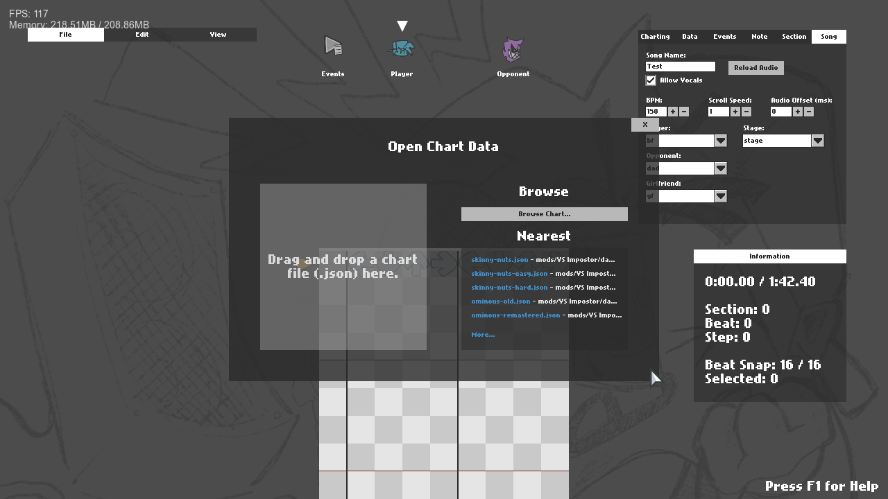
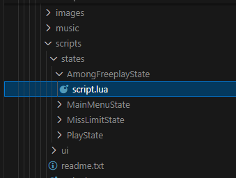
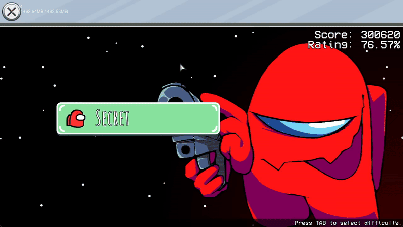

_____________________________________

# Friday Night Funkin' - Psychness Engine

このエンジンは、[Psych Engine](https://github.com/ShadowMario/FNF-PsychEngine) 1.0.3を改造し、様々な機能を追加したちょっぴり上級者向けのエンジンです。

上のLogoが[Codename Engine](https://github.com/CodenameCrew/CodenameEngine)のパクリとか言わないでくださいね？！　Logo作るのも大変なんですから！

## ビルドするには？
Psych Engineと変わらないはずです！

[Psych Engine 1.x のビルド方法はこちらを参照してください！](https://github.com/ShadowMario/FNF-PsychEngine/blob/main/docs/BUILDING.md)

## 新しい機能の例:

### 少しだけ改造されたチャートエディタ

- 履歴機能が追加されました。
- Ctrl + OでOpponentのNoteが全選択(現在のSection内のみ)できるようになりました。
- Ctrl + PでPlayerのNoteが全選択(現在のSection内のみ)できるようになりました。
- チャートがセーブされていない状態でゲームを閉じようとすると、警告が現れるようになりました。

### 全く新しい？Luaの世界

おや...？

- Main MenuでLuaが使用可能
- Custom Stateで0からLuaでStateを組み立てることが可能 (上のgifもこれで作られました!)

### Modの個性をさらに目立たせよう！

- `pack.json`と同じルートに`header.png`という名前の画像フォルダを入れてみてください！
  上の画像のように表示させるはずです！ (サイズは1280 × 720をおすすめします。)

## クレジット:

### Psychness Engine

- _nes0116 - Head Developer, Programmer.

### Psych Engine

* Shadow Mario - Head Developer, Programmer.

* Riveren - Main Artist.

### Special Thanks

* bbpanzu - Ex-Team Member (Programmer).

* crowplexus - HScript Iris, Input System v3, and Other PRs.

* Kamizeta - Creator of Pessy, Psych Engine's mascot.

* MaxNeton - Loading Screen Easter Egg Artist/Animator.

* Keoiki - Note Splash Animations and Latin Alphabet.

* SqirraRNG - Crash Handler and Base code for Chart Editor's Waveform.

* EliteMasterEric - Runtime Shaders support and Other PRs.

* MAJigsaw77 - .MP4 Video Loader Library (hxvlc).

* Tahir Toprak Karabekiroglu - Note Splash Editor and Other PRs.

* iFlicky - Composer of Psync, Tea Time and some sound effects.

* KadeDev - Fixed some issues on Chart Editor and Other PRs.

* superpowers04 - LUA JIT Fork.

* CheemsAndFriends - Creator of FlxAnimate.

* Ezhalt - Pessy's Easter Egg Jingle.

* MaliciousBunny - Video for the Final Update.

_____________________________________
